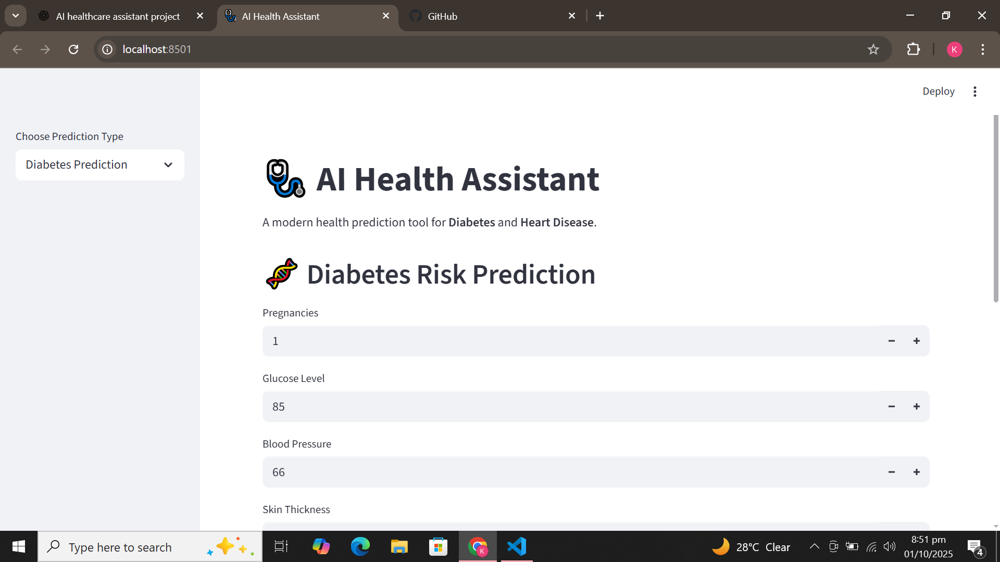
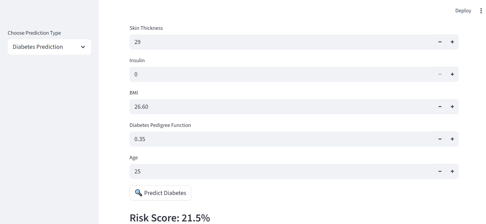
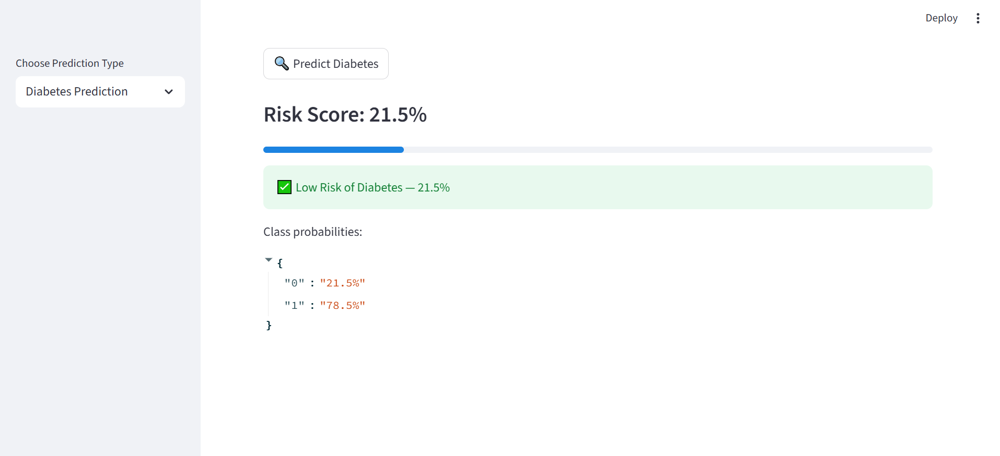
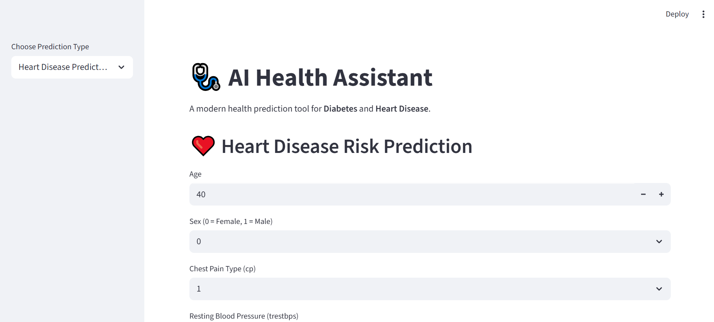
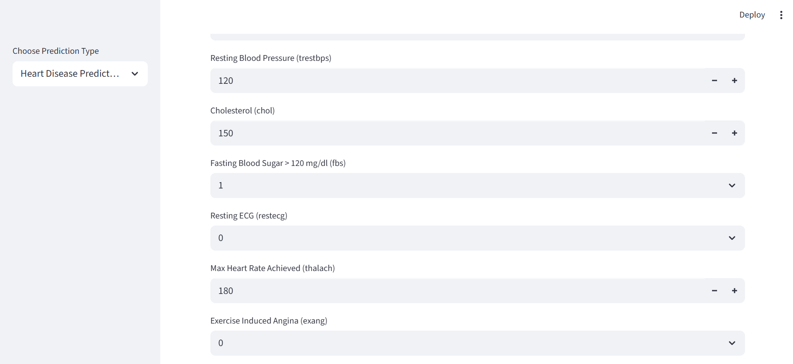
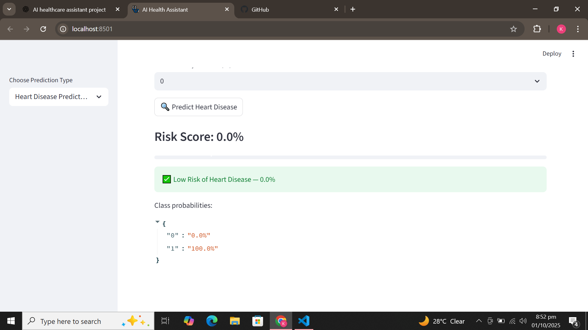

# 🩺 AI Health Assistant

A simple **AI-powered health prediction tool** built using **Streamlit**.  
Currently supports **Diabetes** and **Heart Disease** risk prediction using trained machine learning models.  

The project is designed with a clean UI, is easy to run, and is extendable for future features.

---

## 🚀 Features
- 🧬 **Diabetes Prediction**  
  Enter details like glucose level, BMI, insulin, etc., and get prediction with probability.  

- ❤️ **Heart Disease Prediction**  
  Enter health indicators like blood pressure, cholesterol, chest pain type, etc., and get risk assessment.  

- 📊 **Probability Bar**  
  Predictions are shown with a percentage bar for confidence level.  

- 🎨 **Modern Streamlit UI**  
  Simple, clean, and responsive web interface.  

---

## 🛠️ Tech Stack
- **Python 3.9+**
- **Streamlit** – frontend web interface
- **Scikit-learn** – machine learning models
- **Joblib** – model saving/loading
- **NumPy** – numerical processing

---

## 📂 Project Structure
```bash
ai-health-assistant/
│
├── app/
│   └── streamlit_app.py       # Main Streamlit UI
│
├── models/
│   ├── diabetes_model.pkl     # Trained Diabetes model
│   └── heart_model.pkl        # Trained Heart Disease model
│
├── services/
│   └── api.py                 # API file (future integration)
│
├── screenshots/               # App screenshots
│   ├── 1.png
│   ├── 2.png
│   ├── 3.png
│   ├── 4.png
│   ├── 5.png
│   └── 6.png
│
├── venv/                      # Virtual environment
└── README.md
```

---

## 📸 Screenshots

<p align="center">
  <br>
  <br>
  <br>
  <br>
  <br>
  
</p>

---

## ▶️ How to Run

1. **Clone this repository**
   ```bash
   git clone https://github.com/your-username/ai-health-assistant.git
   cd ai-health-assistant
   ```

2. **Create and activate a virtual environment**
   ```bash
   python -m venv venv
   venv\Scripts\activate   # On Windows
   source venv/bin/activate  # On Linux/Mac
   ```

3. **Install dependencies**
   ```bash
   pip install -r requirements.txt
   ```

4. **Run the app**
   ```bash
   streamlit run app/streamlit_app.py
   ```

---

## ✅ Example Predictions

**Diabetes Prediction:**  
- Glucose = 150, BMI = 35 → **High Risk**  
- Glucose = 100, BMI = 22 → **Low Risk**  

**Heart Disease Prediction:**  
- Age = 60, Cholesterol = 280, High Blood Pressure → **High Risk**  
- Age = 25, Cholesterol = 180, Normal BP → **Low Risk**  

---

## 🔮 Future Improvements
Planned extensions for this project:  

- 🤖 **RAG-based Chatbot** – explain predictions and give advice  
- 📈 **More Diseases** – Cancer, Kidney disease, etc.  
- 🌍 **Health Dashboard** – monitor progress over time  
- 📱 **Mobile App Version** – for accessibility  
- ☁️ **Cloud Deployment** – Streamlit Cloud, Hugging Face Spaces, or Heroku  

---

## 📌 Notes
⚠️ This tool is for **educational purposes only** and is **not a substitute for professional medical advice**.  
Always consult a doctor for health-related concerns.  

---

## 👨‍💻 Author
Developed by **Kashif Ali**  
Focused on learning **AI, ML, and Health Applications**.  
